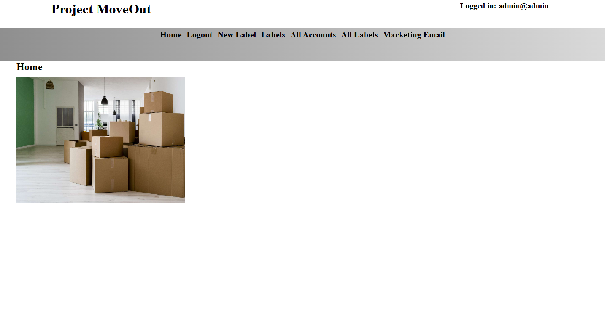

Introduction
This is the isntruction file for the Moveout project app. The app will give users a platform to create personalized labels for moving boxes.

Prerequisites 
WSL terminal, mariadb server, 

Install the projekt mapp
Enter the map via a wsl or linux terminal environment
    
    Type: npm install 

Build   
    Create .env file with these variables
    MARIADB_HOST MariaDb host ip
    MARIADB_PORT Mariadb port
    MARIADB_USER Mariadb User
    MARIADB_PASSWORD Mariadb password
    MARIADB_DATABASE Mariadb database
    JWT_SECRET JWT secret
    EMAIL Email for node.mailer
    EMAIL_PASSWORD app password for email
    PROJECT_DIR True path to project 
    ADMIN_PASSWORD Admin password
    ADMIN_EMAIL Admin Email

Enter the SQL folder 
    Source the reset.sql to initiate database in the mariadb terminal interface
    type: source reset.sql

Create a font awesome folder
Stand in the root folder
RUN mkdir -p /public/fontawesome/

Download the library and extract the content into the newly created mapp
https://fontawesome.com/download

TEST
    Stand in the root project folder
    TYPE: npm test

RUN
    Stand in the directory where app.js is
    type: node app.js
    
License

MIT License

Copyright (c) [2024] [Daniel Svensson]

Permission is hereby granted, free of charge, to any person obtaining a copy
of this software and associated documentation files (the "Software"), to deal
in the Software without restriction, including without limitation the rights
to use, copy, modify, merge, publish, distribute, sublicense, and/or sell
copies of the Software, and to permit persons to whom the Software is
furnished to do so, subject to the following conditions:

The above copyright notice and this permission notice shall be included in all
copies or substantial portions of the Software.

THE SOFTWARE IS PROVIDED "AS IS", WITHOUT WARRANTY OF ANY KIND, EXPRESS OR
IMPLIED, INCLUDING BUT NOT LIMITED TO THE WARRANTIES OF MERCHANTABILITY,
FITNESS FOR A PARTICULAR PURPOSE AND NONINFRINGEMENT. IN NO EVENT SHALL THE
AUTHORS OR COPYRIGHT HOLDERS BE LIABLE FOR ANY CLAIM, DAMAGES OR OTHER
LIABILITY, WHETHER IN AN ACTION OF CONTRACT, TORT OR OTHERWISE, ARISING FROM,
OUT OF OR IN CONNECTION WITH THE SOFTWARE OR THE USE OR OTHER DEALINGS IN THE
SOFTWARE.

